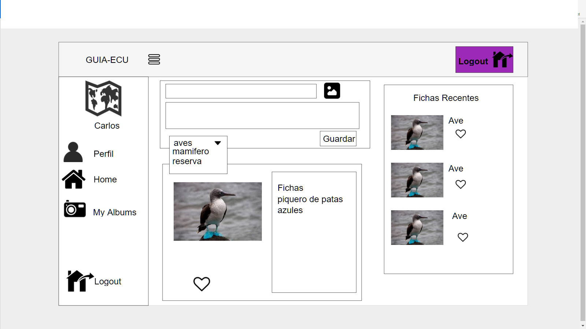
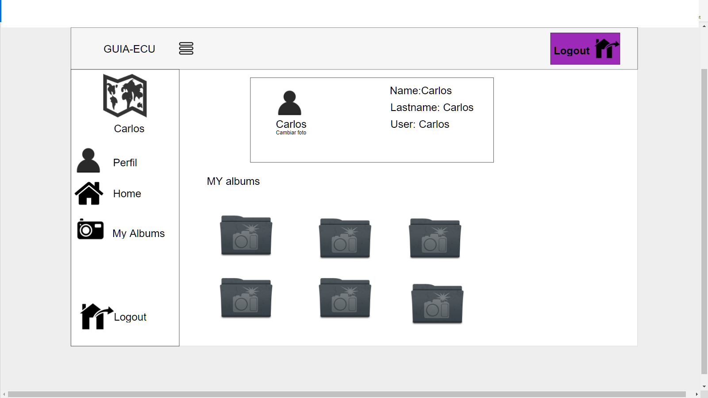
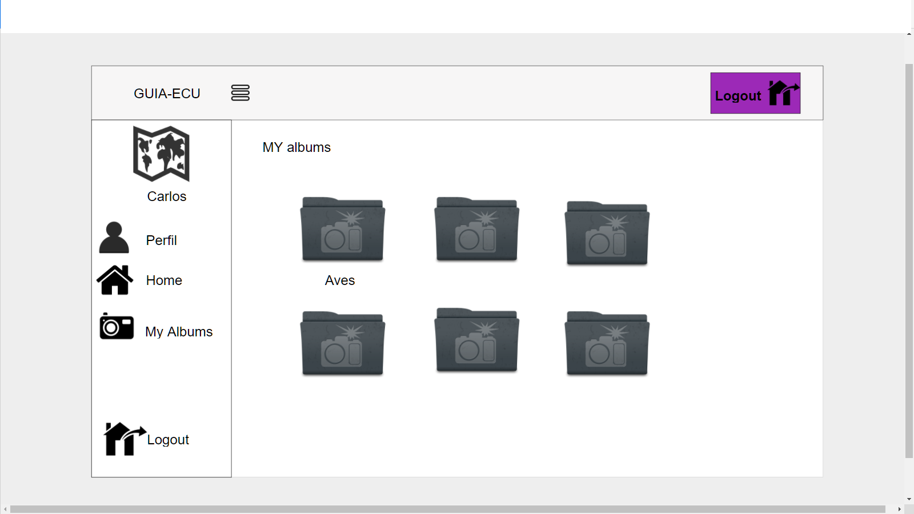
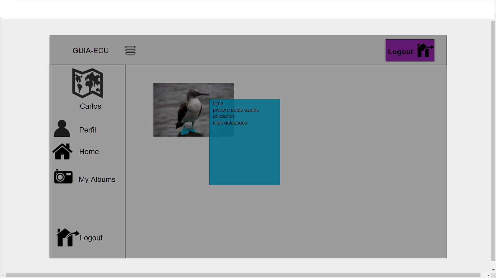
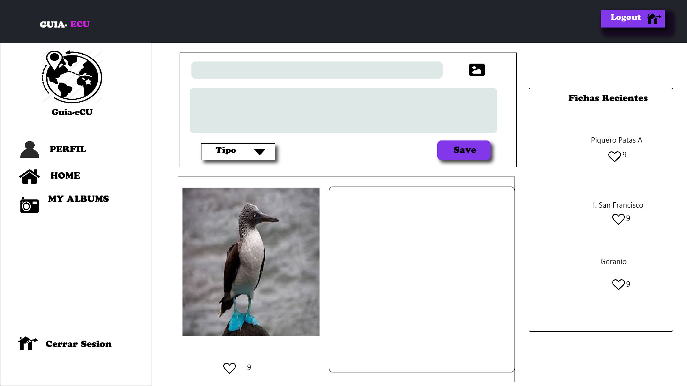
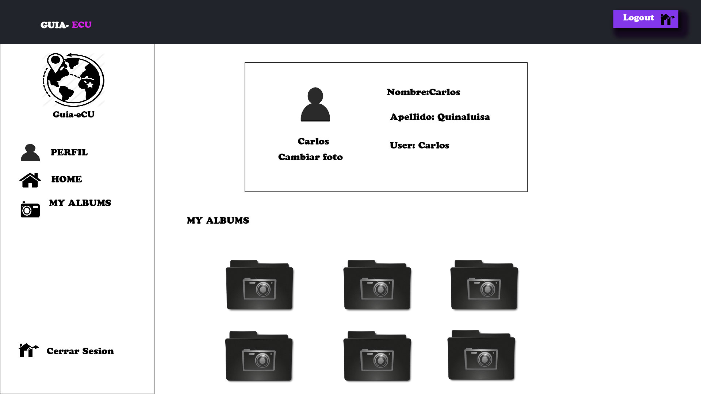
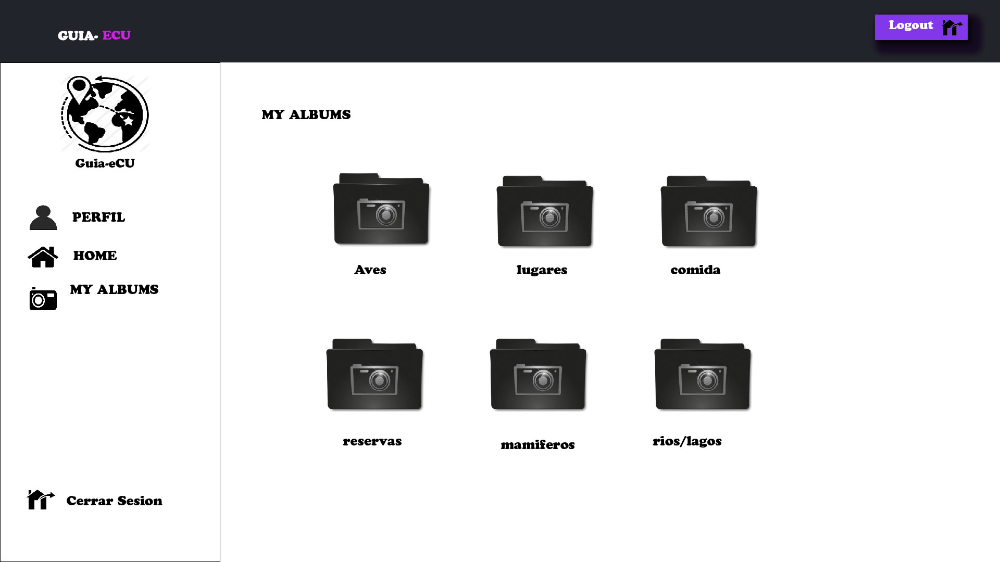
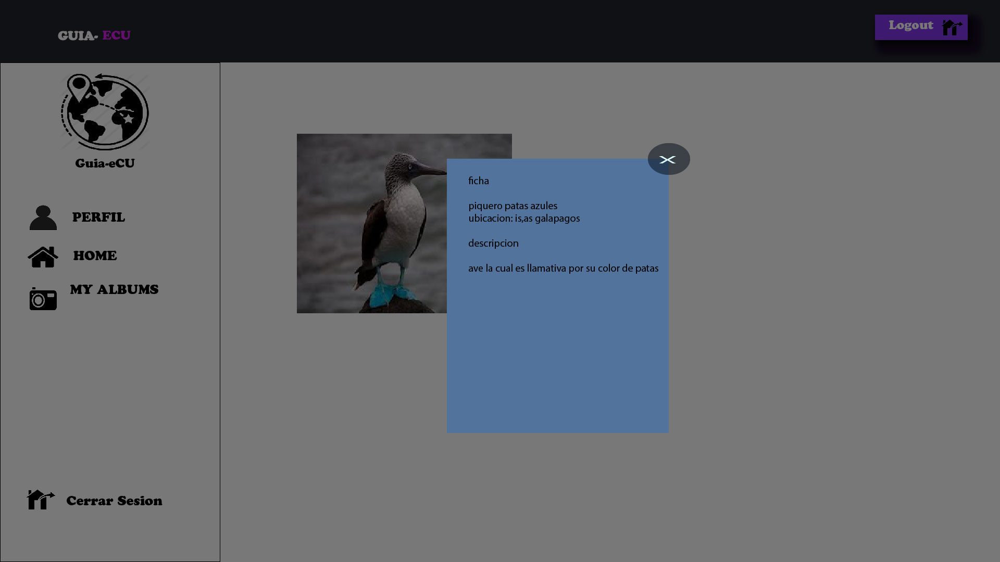

# Link-Ecu

## Objetivos Personales

* Hacer un examen de coinciencia y ver cuales son mis puntos mas fuertes en programacion y con ello ir mejorando hasta poder tener mucha creatividad
* Después de finalizar todo esto quiero hacerme un auto análisis y ver que aprendí en que mejore y que debo reforzar... 
* Esto me sirve para ver cómo entre y como salí de esta fase práctica  
* Aprender un poco mas sobre nuevas herramientas de programación  como de diseño gráfico
* Seguir estudiando sobre servidores, base de datos y lo que es programacion movil

## Investigación :Guia-Turistica:

La investigacion que se realizo a estudiantes de guias turisticos y amantes de la naturaleza, muchos de ellos dicen que es muy complicado el tener que llevar muchos documentos, existen varias plataformas; pero no una la cual les ayude a tener sus propias ficha, sobretodo con un lenguaje entendible, las cuales puedan interactuar; ya sea por fotos e informacion.

Por el cual se va a crear una **Aplicacion de Fichas Digitales** para el mundo del turismo.

La Aplicacion constara con los siguientes modulos:

* Home
* Perfil
* Albumes(donde se almacenara todos los posteos por carpetas)
* Fichas

##PANTALLAS

###Wireframes

###Mockups

